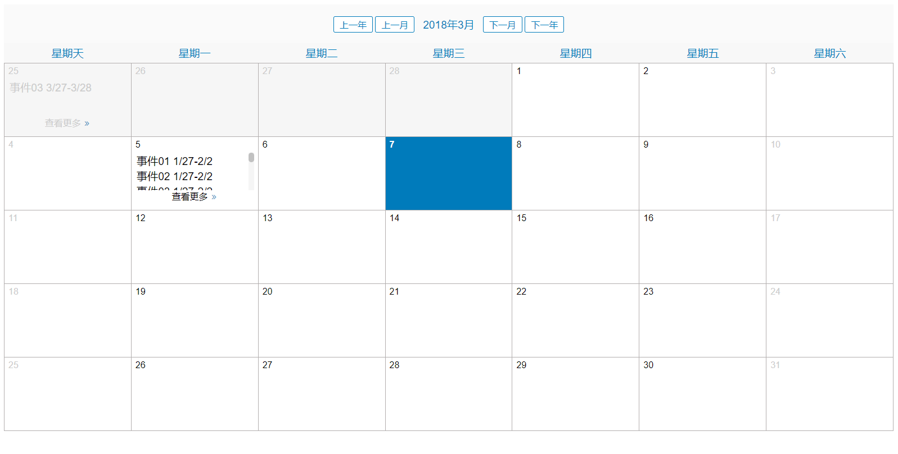

# vue-event-fullcalendar

> A vue plugin for showing events calendar. It only supports month view, and will add week view in the future.

### Screenshots



### install

By npm
```
npm i vue-event-fullcalendar@latest -S
```
By yarn
```
yarn add vue-event-fullcalendar@latest
```
By script
```
<script src='dist/js/vue-fulcalendar.min.js'>
```

### Usage

Register component globally

```
import Vue from 'vue'
import App from './App'
import VueEventFullCalendar from 'vue-event-fullcalendar'

Vue.config.productionTip = false
Vue.use(VueEventFullCalendar)

new Vue({
  el: '#app',
  template: '<App/>',
  components: { App }
})

```

or register locally in your `.vue` file

### Example

```
<template>
  <div id="app">
    <event-full-calendar :events="demoEvents"></event-full-calendar>
  </div>
</template>

<script>
export default {
  name: 'app',
  data () {
    return {
      demoEvents: [
        {
          eventlist: [
            {title: '事件01 1/27-2/2'},
            {title: '事件02 1/27-2/2'},
            {title: '事件03 1/27-2/2'},
            {title: '事件04 1/27-2/2'},
            {title: '事件05 1/27-2/2'},
            {title: '事件06 1/27-2/2'},
            {title: '事件07 1/27-2/2'},
            {title: '事件08 1/27-2/2'},
            {title: '事件001 1/27-2/2'},
            {title: '事件021 1/27-2/2'},
            {title: '事件041 1/27-2/2'},
            {title: '事件026 1/27-2/2'}
          ],
          date: '2018-03-05'
        },
        {
          eventlist: [
            {title: '事件03 3/27-3/28'}
          ],
          date: '2018-02-25'
        }
      ]
    }
  }
}
</script>
```

here is a demo screenshots


### Docs

#### props

| Name        | Description           | Type           | default |
| -------------|:-------------:|:-------------:| -----:|
| primaryColor     | set calendar primary color | String | #007bbb |
| events      | events will be displayed on the calendar | Array | - |

#### events props

| Name        | Description           | Type           | default |
| -------------|:-------------:|:-------------:| -----:|
| eventlist     | event list | Array | - |
| date      | eventlist date | String | - |

#### eventlist props

| Name        | Description           | Type           | default |
| -------------|:-------------:|:-------------:| -----:|
| title     | event item title | string | - |

```
// example
demoEvents: [
    {
        eventlist: [
            {
                title: '事件01 1/27-2/2'
            },
            {
                title: '事件02 1/27-2/2'
            }
        ],
        date: '2018-03-05'
    }
]
```